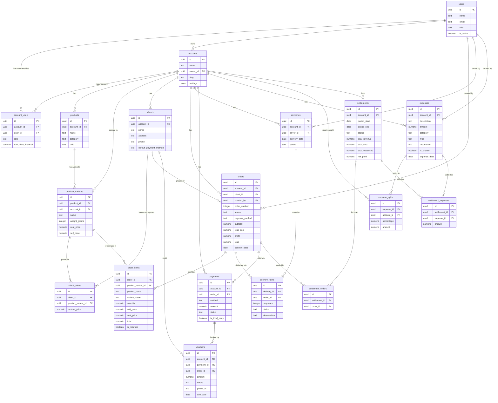

# Distriall - Architecture Document

> **Version:** 1.0
> **Date:** 2026-06-08
> **Author:** Aria (Architect Agent)
> **Status:** Approved - Ready for implementation
> **Source:** PRD v1.0 + Intake Report (30 audios)

---

## Table of Contents

1. [Decision: PWA vs React Native](#1-decision-pwa-vs-react-native)
2. [Definitive Stack](#2-definitive-stack)
3. [Database Schema (PostgreSQL)](#3-database-schema-postgresql)
4. [RLS Policies](#4-rls-policies)
5. [Project Folder Structure](#5-project-folder-structure)
6. [API Routes](#6-api-routes)
7. [Offline-First Strategy](#7-offline-first-strategy)
8. [Thermal Printer Integration (58mm Bluetooth)](#8-thermal-printer-integration-58mm-bluetooth)
9. [Entity Relationship Diagram](#9-entity-relationship-diagram)

---

## 1. Decision: PWA vs React Native

### Context

The system requires Bluetooth printing to a 58mm thermal printer (ESC/POS protocol). This is the single deciding factor between PWA and React Native — all other requirements (offline, multi-account, CRUD) work equally well in both.

### Analysis

| Criteria | PWA (Web Bluetooth API) | React Native (react-native-ble-plx) |
|----------|------------------------|--------------------------------------|
| **Bluetooth printing** | Supported on Android Chrome 56+. Web Bluetooth API provides GATT access to ESC/POS printers. Tested and functional with generic 58mm thermal printers. NOT supported on iOS Safari. | Full native BLE access. Mature libraries. Works on both Android and iOS. |
| **Android support** | Full. Chrome on Android is the primary target. All 3 users use Android. | Full. |
| **iOS support** | Web Bluetooth blocked on Safari/WebKit. | Full. |
| **Web (desktop) access** | Native — same codebase. Diego uses PC frequently (NFR-02). | Requires separate web build (React Native Web) or a separate web app. |
| **Offline capability** | Service Worker + Cache API. Well-supported. | AsyncStorage / SQLite. Well-supported. |
| **Development speed** | Single codebase for mobile + desktop. No app store. Faster iterations. | Two platforms to manage. App store review cycles. |
| **Installation** | "Add to Home Screen" prompt. No app store required. | Requires APK sideload or Play Store. |
| **Maintenance cost** | Low. Web deployment only. | Medium. Native builds, app signing, store updates. |
| **User count** | 2-3 users. Overkill to maintain native builds. | Justified for 100+ users, not for 3. |

### Decision: PWA

**Rationale:**

1. **Web Bluetooth works on Android Chrome** — All 3 users are on Android. iOS incompatibility is irrelevant for this project.
2. **Diego needs desktop access** — PWA gives this for free. React Native would require a separate web project or React Native Web (added complexity).
3. **2-3 users do not justify native complexity** — No app store overhead, no native build toolchain, no code signing.
4. **Faster time-to-market** — Single codebase, single deployment target, instant updates without app store review.
5. **Fallback exists** — If Bluetooth fails on any specific device, the receipt can be displayed on screen for screenshot/sharing (FR-12 AC5).

**Risk mitigation:** Before starting Epic 2 (printing story), run a proof-of-concept on Tiago's actual phone + printer using Web Bluetooth API. If it fails, the fallback path is a lightweight Android wrapper (TWA - Trusted Web Activity) that exposes native Bluetooth via a JavaScript bridge — still using the same web codebase.

### Rejected Alternative: React Native

Not chosen because it doubles development effort for 3 users, complicates Diego's desktop workflow, and introduces app store deployment overhead — all to solve a Bluetooth problem that Web Bluetooth already handles on Android Chrome.

---

## 2. Definitive Stack

| Layer | Technology | Version | Rationale |
|-------|-----------|---------|-----------|
| **Frontend** | Next.js (App Router) | 15.x | SSR/SSG, file-based routing, excellent PWA support via `next-pwa`. React ecosystem. |
| **PWA** | next-pwa (Serwist) | latest | Service worker generation, precaching, runtime caching strategies. |
| **UI Library** | Tailwind CSS + shadcn/ui | 4.x / latest | Utility-first CSS. shadcn provides accessible, unstyled components. Mobile-first responsive. |
| **State Management** | Zustand | 5.x | Lightweight, no boilerplate. Perfect for account switching, cart state, offline queue. |
| **Backend (BaaS)** | Supabase | latest | Auth, PostgreSQL, Storage, Realtime subscriptions. Free tier covers this scale. |
| **Database** | PostgreSQL (via Supabase) | 15+ | Relational, RLS nativo for multi-tenant, JSONB for flexible fields, excellent for financial data. |
| **Auth** | Supabase Auth | — | Email/password. Simple, no OAuth needed for 3 users. |
| **Storage** | Supabase Storage | — | Voucher photos (vales). RLS-protected buckets per account. |
| **Offline DB** | Dexie.js (IndexedDB) | 4.x | Structured offline storage for orders, product cache. Syncs with Supabase when online. |
| **Bluetooth** | Web Bluetooth API | — | Native browser API. No library needed. ESC/POS commands sent as raw bytes. |
| **Charts** | Recharts | 2.x | Simple, React-native charting. Covers dashboard needs (bar, pie, line). |
| **Hosting (Frontend)** | Vercel | — | Zero-config Next.js deployment. Free tier sufficient (2-3 users). |
| **Hosting (Backend)** | Supabase Cloud | Free tier | 500MB DB, 1GB storage, 50K monthly active users. Far exceeds needs. |
| **Package Manager** | pnpm | 9.x | Fast, disk-efficient. Workspace support for monorepo. |
| **Language** | TypeScript | 5.x | Type safety across entire stack. Shared types between frontend and Supabase. |

### Cost Estimate (Monthly)

| Service | Plan | Cost |
|---------|------|------|
| Vercel | Hobby (free) | R$ 0 |
| Supabase | Free tier | R$ 0 |
| Domain (optional) | .com.br | ~R$ 40/year |
| **Total** | — | **R$ 0 - 3/month** |

The entire system runs on free tiers. Supabase Pro (US$ 25/month) only needed if exceeding 500MB DB or needing daily backups — unlikely with this data volume.

---

## 3. Database Schema (PostgreSQL)

### 3.1 Core Tables

#### `users`

Extends Supabase `auth.users`. Stores application-level profile data.

```sql
CREATE TABLE public.users (
  id UUID PRIMARY KEY REFERENCES auth.users(id) ON DELETE CASCADE,
  name TEXT NOT NULL,
  email TEXT NOT NULL UNIQUE,
  phone TEXT,
  role TEXT NOT NULL CHECK (role IN ('admin', 'vendedor', 'entregador')),
  avatar_url TEXT,
  is_active BOOLEAN NOT NULL DEFAULT true,
  created_at TIMESTAMPTZ NOT NULL DEFAULT now(),
  updated_at TIMESTAMPTZ NOT NULL DEFAULT now()
);

CREATE INDEX idx_users_email ON public.users(email);
CREATE INDEX idx_users_role ON public.users(role);
```

#### `accounts`

Business units (contas). Each represents an independent operation with its own products, clients, pricing, and financials.

```sql
CREATE TABLE public.accounts (
  id UUID PRIMARY KEY DEFAULT gen_random_uuid(),
  name TEXT NOT NULL,
  owner_id UUID NOT NULL REFERENCES public.users(id),
  slug TEXT NOT NULL UNIQUE, -- 'distrial-rp', 'tiago', 'distrial-votoporanga'
  is_active BOOLEAN NOT NULL DEFAULT true,
  settings JSONB DEFAULT '{}', -- account-specific settings
  created_at TIMESTAMPTZ NOT NULL DEFAULT now(),
  updated_at TIMESTAMPTZ NOT NULL DEFAULT now()
);

CREATE INDEX idx_accounts_owner ON public.accounts(owner_id);
CREATE INDEX idx_accounts_slug ON public.accounts(slug);
```

#### `account_users`

Junction table: which users have access to which accounts, and with what role.

```sql
CREATE TABLE public.account_users (
  id UUID PRIMARY KEY DEFAULT gen_random_uuid(),
  account_id UUID NOT NULL REFERENCES public.accounts(id) ON DELETE CASCADE,
  user_id UUID NOT NULL REFERENCES public.users(id) ON DELETE CASCADE,
  role TEXT NOT NULL CHECK (role IN ('admin', 'vendedor', 'entregador', 'visualizador')),
  can_view_financial BOOLEAN NOT NULL DEFAULT false,
  is_active BOOLEAN NOT NULL DEFAULT true,
  created_at TIMESTAMPTZ NOT NULL DEFAULT now(),

  UNIQUE(account_id, user_id)
);

CREATE INDEX idx_account_users_account ON public.account_users(account_id);
CREATE INDEX idx_account_users_user ON public.account_users(user_id);
```

#### `products`

Master product record per account.

```sql
CREATE TABLE public.products (
  id UUID PRIMARY KEY DEFAULT gen_random_uuid(),
  account_id UUID NOT NULL REFERENCES public.accounts(id) ON DELETE CASCADE,
  name TEXT NOT NULL,
  description TEXT,
  category TEXT, -- optional grouping
  unit TEXT NOT NULL DEFAULT 'un', -- 'un', 'kg', 'g', 'l'
  is_active BOOLEAN NOT NULL DEFAULT true,
  created_at TIMESTAMPTZ NOT NULL DEFAULT now(),
  updated_at TIMESTAMPTZ NOT NULL DEFAULT now()
);

CREATE INDEX idx_products_account ON public.products(account_id);
CREATE INDEX idx_products_name ON public.products(account_id, name);
```

#### `product_variants`

Size/weight variations of a product (e.g., Creme de Cebola 500g, 1kg, 5kg, 25kg).

```sql
CREATE TABLE public.product_variants (
  id UUID PRIMARY KEY DEFAULT gen_random_uuid(),
  product_id UUID NOT NULL REFERENCES public.products(id) ON DELETE CASCADE,
  account_id UUID NOT NULL REFERENCES public.accounts(id) ON DELETE CASCADE,
  name TEXT NOT NULL, -- '500g', '1kg', '25kg'
  weight_grams INTEGER, -- weight in grams for sorting/calculations
  cost_price NUMERIC(10,2) NOT NULL, -- preco de custo
  sell_price NUMERIC(10,2) NOT NULL, -- preco de venda padrao
  sku TEXT, -- optional SKU
  is_active BOOLEAN NOT NULL DEFAULT true,
  created_at TIMESTAMPTZ NOT NULL DEFAULT now(),
  updated_at TIMESTAMPTZ NOT NULL DEFAULT now()
);

CREATE INDEX idx_product_variants_product ON public.product_variants(product_id);
CREATE INDEX idx_product_variants_account ON public.product_variants(account_id);
```

#### `clients`

Customer records per account. A physical client (e.g., "Frigorifico Espanha") can exist in multiple accounts with different pricing.

```sql
CREATE TABLE public.clients (
  id UUID PRIMARY KEY DEFAULT gen_random_uuid(),
  account_id UUID NOT NULL REFERENCES public.accounts(id) ON DELETE CASCADE,
  name TEXT NOT NULL,
  trade_name TEXT, -- nome fantasia
  address TEXT,
  city TEXT,
  neighborhood TEXT, -- bairro
  phone TEXT,
  whatsapp TEXT,
  default_payment_method TEXT CHECK (default_payment_method IN ('dinheiro', 'pix', 'boleto', 'vale', 'cartao')),
  notes TEXT,
  is_active BOOLEAN NOT NULL DEFAULT true,
  created_at TIMESTAMPTZ NOT NULL DEFAULT now(),
  updated_at TIMESTAMPTZ NOT NULL DEFAULT now()
);

CREATE INDEX idx_clients_account ON public.clients(account_id);
CREATE INDEX idx_clients_name ON public.clients(account_id, name);
```

#### `client_prices`

Price overrides per client per product variant. If no entry exists, the default `product_variants.sell_price` is used.

```sql
CREATE TABLE public.client_prices (
  id UUID PRIMARY KEY DEFAULT gen_random_uuid(),
  account_id UUID NOT NULL REFERENCES public.accounts(id) ON DELETE CASCADE,
  client_id UUID NOT NULL REFERENCES public.clients(id) ON DELETE CASCADE,
  product_variant_id UUID NOT NULL REFERENCES public.product_variants(id) ON DELETE CASCADE,
  custom_price NUMERIC(10,2) NOT NULL,
  created_at TIMESTAMPTZ NOT NULL DEFAULT now(),
  updated_at TIMESTAMPTZ NOT NULL DEFAULT now(),

  UNIQUE(client_id, product_variant_id)
);

CREATE INDEX idx_client_prices_client ON public.client_prices(client_id);
CREATE INDEX idx_client_prices_account ON public.client_prices(account_id);
```

### 3.2 Order Tables

#### `orders`

```sql
CREATE TABLE public.orders (
  id UUID PRIMARY KEY DEFAULT gen_random_uuid(),
  account_id UUID NOT NULL REFERENCES public.accounts(id) ON DELETE CASCADE,
  client_id UUID NOT NULL REFERENCES public.clients(id),
  created_by UUID NOT NULL REFERENCES public.users(id),
  order_number SERIAL, -- human-readable sequential number per account
  status TEXT NOT NULL DEFAULT 'lancado'
    CHECK (status IN ('lancado', 'confirmado', 'carregado', 'entregue', 'cancelado')),
  payment_method TEXT CHECK (payment_method IN ('dinheiro', 'pix', 'boleto', 'vale', 'cartao', 'misto')),
  subtotal NUMERIC(12,2) NOT NULL DEFAULT 0,
  total_cost NUMERIC(12,2) NOT NULL DEFAULT 0, -- custo total das mercadorias
  profit NUMERIC(12,2) NOT NULL DEFAULT 0, -- subtotal - total_cost
  discount NUMERIC(10,2) NOT NULL DEFAULT 0,
  total NUMERIC(12,2) NOT NULL DEFAULT 0, -- subtotal - discount
  notes TEXT,
  delivery_date DATE, -- data prevista de entrega
  delivered_at TIMESTAMPTZ,
  confirmed_at TIMESTAMPTZ,
  loaded_at TIMESTAMPTZ,
  cancelled_at TIMESTAMPTZ,
  created_at TIMESTAMPTZ NOT NULL DEFAULT now(),
  updated_at TIMESTAMPTZ NOT NULL DEFAULT now()
);

CREATE INDEX idx_orders_account ON public.orders(account_id);
CREATE INDEX idx_orders_client ON public.orders(client_id);
CREATE INDEX idx_orders_status ON public.orders(account_id, status);
CREATE INDEX idx_orders_created_at ON public.orders(account_id, created_at DESC);
CREATE INDEX idx_orders_delivery_date ON public.orders(delivery_date);
CREATE INDEX idx_orders_created_by ON public.orders(created_by);
```

#### `order_items`

```sql
CREATE TABLE public.order_items (
  id UUID PRIMARY KEY DEFAULT gen_random_uuid(),
  order_id UUID NOT NULL REFERENCES public.orders(id) ON DELETE CASCADE,
  account_id UUID NOT NULL REFERENCES public.accounts(id) ON DELETE CASCADE,
  product_variant_id UUID NOT NULL REFERENCES public.product_variants(id),
  product_name TEXT NOT NULL, -- snapshot at order time
  variant_name TEXT NOT NULL, -- snapshot at order time
  quantity NUMERIC(10,3) NOT NULL,
  unit_price NUMERIC(10,2) NOT NULL, -- price at order time (custom or default)
  cost_price NUMERIC(10,2) NOT NULL, -- cost at order time
  total NUMERIC(12,2) NOT NULL, -- quantity * unit_price
  total_cost NUMERIC(12,2) NOT NULL, -- quantity * cost_price
  is_returned BOOLEAN NOT NULL DEFAULT false,
  returned_quantity NUMERIC(10,3) DEFAULT 0,
  return_reason TEXT,
  returned_at TIMESTAMPTZ,
  created_at TIMESTAMPTZ NOT NULL DEFAULT now()
);

CREATE INDEX idx_order_items_order ON public.order_items(order_id);
CREATE INDEX idx_order_items_account ON public.order_items(account_id);
CREATE INDEX idx_order_items_variant ON public.order_items(product_variant_id);
```

### 3.3 Delivery Tables

#### `deliveries`

Represents a delivery route/run for a specific day. Contains multiple orders.

```sql
CREATE TABLE public.deliveries (
  id UUID PRIMARY KEY DEFAULT gen_random_uuid(),
  account_id UUID NOT NULL REFERENCES public.accounts(id) ON DELETE CASCADE,
  driver_id UUID NOT NULL REFERENCES public.users(id),
  delivery_date DATE NOT NULL,
  status TEXT NOT NULL DEFAULT 'pendente'
    CHECK (status IN ('pendente', 'em_rota', 'concluida')),
  notes TEXT,
  started_at TIMESTAMPTZ,
  completed_at TIMESTAMPTZ,
  created_at TIMESTAMPTZ NOT NULL DEFAULT now(),
  updated_at TIMESTAMPTZ NOT NULL DEFAULT now()
);

CREATE INDEX idx_deliveries_account ON public.deliveries(account_id);
CREATE INDEX idx_deliveries_driver ON public.deliveries(driver_id);
CREATE INDEX idx_deliveries_date ON public.deliveries(delivery_date);
```

#### `delivery_items`

Orders assigned to a delivery route, with sequence for route ordering.

```sql
CREATE TABLE public.delivery_items (
  id UUID PRIMARY KEY DEFAULT gen_random_uuid(),
  delivery_id UUID NOT NULL REFERENCES public.deliveries(id) ON DELETE CASCADE,
  order_id UUID NOT NULL REFERENCES public.orders(id),
  sequence INTEGER NOT NULL, -- position in route
  status TEXT NOT NULL DEFAULT 'pendente'
    CHECK (status IN ('pendente', 'entregue', 'nao_entregue')),
  observation TEXT, -- "recebeu Dona Maria no lugar do Sr. Jose"
  delivered_at TIMESTAMPTZ,
  created_at TIMESTAMPTZ NOT NULL DEFAULT now(),

  UNIQUE(delivery_id, order_id)
);

CREATE INDEX idx_delivery_items_delivery ON public.delivery_items(delivery_id);
CREATE INDEX idx_delivery_items_order ON public.delivery_items(order_id);
```

### 3.4 Financial Tables

#### `payments`

Payment records per order. Supports mixed payments (misto) via multiple records per order.

```sql
CREATE TABLE public.payments (
  id UUID PRIMARY KEY DEFAULT gen_random_uuid(),
  account_id UUID NOT NULL REFERENCES public.accounts(id) ON DELETE CASCADE,
  order_id UUID NOT NULL REFERENCES public.orders(id) ON DELETE CASCADE,
  method TEXT NOT NULL CHECK (method IN ('dinheiro', 'pix', 'boleto', 'vale', 'cartao')),
  amount NUMERIC(12,2) NOT NULL,
  status TEXT NOT NULL DEFAULT 'pendente'
    CHECK (status IN ('pendente', 'confirmado', 'cancelado')),
  -- For boleto: the amount goes to Boa Mesa, profit stays with Tiago
  is_third_party BOOLEAN NOT NULL DEFAULT false, -- true for boleto (Boa Mesa receives)
  notes TEXT,
  confirmed_at TIMESTAMPTZ,
  created_at TIMESTAMPTZ NOT NULL DEFAULT now(),
  updated_at TIMESTAMPTZ NOT NULL DEFAULT now()
);

CREATE INDEX idx_payments_account ON public.payments(account_id);
CREATE INDEX idx_payments_order ON public.payments(order_id);
CREATE INDEX idx_payments_method ON public.payments(account_id, method);
CREATE INDEX idx_payments_status ON public.payments(status);
```

#### `vouchers` (vales)

Physical signed vouchers. Linked to a payment record.

```sql
CREATE TABLE public.vouchers (
  id UUID PRIMARY KEY DEFAULT gen_random_uuid(),
  account_id UUID NOT NULL REFERENCES public.accounts(id) ON DELETE CASCADE,
  payment_id UUID NOT NULL REFERENCES public.payments(id) ON DELETE CASCADE,
  client_id UUID NOT NULL REFERENCES public.clients(id),
  amount NUMERIC(12,2) NOT NULL,
  status TEXT NOT NULL DEFAULT 'pendente'
    CHECK (status IN ('pendente', 'pago', 'vencido', 'cancelado')),
  photo_url TEXT, -- Supabase Storage path
  due_date DATE,
  paid_at TIMESTAMPTZ,
  notes TEXT,
  created_at TIMESTAMPTZ NOT NULL DEFAULT now(),
  updated_at TIMESTAMPTZ NOT NULL DEFAULT now()
);

CREATE INDEX idx_vouchers_account ON public.vouchers(account_id);
CREATE INDEX idx_vouchers_client ON public.vouchers(client_id);
CREATE INDEX idx_vouchers_status ON public.vouchers(account_id, status);
CREATE INDEX idx_vouchers_payment ON public.vouchers(payment_id);
```

#### `expenses`

Operational expenses per account.

```sql
CREATE TABLE public.expenses (
  id UUID PRIMARY KEY DEFAULT gen_random_uuid(),
  account_id UUID NOT NULL REFERENCES public.accounts(id) ON DELETE CASCADE,
  description TEXT NOT NULL,
  amount NUMERIC(12,2) NOT NULL,
  category TEXT NOT NULL CHECK (category IN ('fixo', 'variavel')),
  type TEXT, -- 'impostos', 'gasolina', 'manutencao', 'outros'
  recurrence TEXT CHECK (recurrence IN ('unico', 'semanal', 'mensal')),
  is_shared BOOLEAN NOT NULL DEFAULT false,
  expense_date DATE NOT NULL,
  created_by UUID NOT NULL REFERENCES public.users(id),
  created_at TIMESTAMPTZ NOT NULL DEFAULT now(),
  updated_at TIMESTAMPTZ NOT NULL DEFAULT now()
);

CREATE INDEX idx_expenses_account ON public.expenses(account_id);
CREATE INDEX idx_expenses_date ON public.expenses(expense_date);
CREATE INDEX idx_expenses_category ON public.expenses(account_id, category);
CREATE INDEX idx_expenses_shared ON public.expenses(is_shared) WHERE is_shared = true;
```

#### `expense_splits`

How a shared expense is divided between accounts.

```sql
CREATE TABLE public.expense_splits (
  id UUID PRIMARY KEY DEFAULT gen_random_uuid(),
  expense_id UUID NOT NULL REFERENCES public.expenses(id) ON DELETE CASCADE,
  account_id UUID NOT NULL REFERENCES public.accounts(id) ON DELETE CASCADE,
  percentage NUMERIC(5,2) NOT NULL CHECK (percentage > 0 AND percentage <= 100),
  amount NUMERIC(12,2) NOT NULL, -- calculated: expense.amount * (percentage / 100)
  created_at TIMESTAMPTZ NOT NULL DEFAULT now(),

  UNIQUE(expense_id, account_id)
);

CREATE INDEX idx_expense_splits_expense ON public.expense_splits(expense_id);
CREATE INDEX idx_expense_splits_account ON public.expense_splits(account_id);
```

#### `settlements` (acertos)

Weekly financial settlement per account.

```sql
CREATE TABLE public.settlements (
  id UUID PRIMARY KEY DEFAULT gen_random_uuid(),
  account_id UUID NOT NULL REFERENCES public.accounts(id) ON DELETE CASCADE,
  period_start DATE NOT NULL,
  period_end DATE NOT NULL,
  status TEXT NOT NULL DEFAULT 'rascunho'
    CHECK (status IN ('rascunho', 'conferido', 'fechado')),

  -- Revenue breakdown
  total_revenue NUMERIC(12,2) NOT NULL DEFAULT 0, -- total vendido
  revenue_dinheiro NUMERIC(12,2) NOT NULL DEFAULT 0,
  revenue_pix NUMERIC(12,2) NOT NULL DEFAULT 0,
  revenue_boleto NUMERIC(12,2) NOT NULL DEFAULT 0,
  revenue_vale NUMERIC(12,2) NOT NULL DEFAULT 0,
  revenue_cartao NUMERIC(12,2) NOT NULL DEFAULT 0,

  -- Costs
  total_cost NUMERIC(12,2) NOT NULL DEFAULT 0, -- custo das mercadorias
  total_expenses NUMERIC(12,2) NOT NULL DEFAULT 0, -- gastos (diretos + rateados)
  total_returns NUMERIC(12,2) NOT NULL DEFAULT 0, -- devolucoes

  -- Calculated
  gross_profit NUMERIC(12,2) NOT NULL DEFAULT 0, -- revenue - cost
  net_profit NUMERIC(12,2) NOT NULL DEFAULT 0, -- gross_profit - expenses - returns

  -- Metadata
  order_count INTEGER NOT NULL DEFAULT 0,
  client_count INTEGER NOT NULL DEFAULT 0,
  pending_vouchers_count INTEGER NOT NULL DEFAULT 0,
  pending_vouchers_amount NUMERIC(12,2) NOT NULL DEFAULT 0,

  notes TEXT,
  closed_by UUID REFERENCES public.users(id),
  closed_at TIMESTAMPTZ,
  created_at TIMESTAMPTZ NOT NULL DEFAULT now(),
  updated_at TIMESTAMPTZ NOT NULL DEFAULT now()
);

CREATE INDEX idx_settlements_account ON public.settlements(account_id);
CREATE INDEX idx_settlements_period ON public.settlements(period_start, period_end);
CREATE INDEX idx_settlements_status ON public.settlements(status);
```

#### `settlement_orders`

Junction: which orders are included in a settlement.

```sql
CREATE TABLE public.settlement_orders (
  id UUID PRIMARY KEY DEFAULT gen_random_uuid(),
  settlement_id UUID NOT NULL REFERENCES public.settlements(id) ON DELETE CASCADE,
  order_id UUID NOT NULL REFERENCES public.orders(id),
  created_at TIMESTAMPTZ NOT NULL DEFAULT now(),

  UNIQUE(settlement_id, order_id)
);

CREATE INDEX idx_settlement_orders_settlement ON public.settlement_orders(settlement_id);
CREATE INDEX idx_settlement_orders_order ON public.settlement_orders(order_id);
```

#### `settlement_expenses`

Junction: which expenses are included in a settlement.

```sql
CREATE TABLE public.settlement_expenses (
  id UUID PRIMARY KEY DEFAULT gen_random_uuid(),
  settlement_id UUID NOT NULL REFERENCES public.settlements(id) ON DELETE CASCADE,
  expense_id UUID NOT NULL REFERENCES public.expenses(id),
  amount NUMERIC(12,2) NOT NULL, -- actual amount charged (may be split)
  created_at TIMESTAMPTZ NOT NULL DEFAULT now(),

  UNIQUE(settlement_id, expense_id)
);

CREATE INDEX idx_settlement_expenses_settlement ON public.settlement_expenses(settlement_id);
```

### 3.5 Sync Table (Offline Support)

#### `sync_queue`

Client-side only (Dexie.js/IndexedDB). NOT a Supabase table. Stores operations created offline, pending sync.

```typescript
// Dexie.js schema (IndexedDB)
interface SyncQueueItem {
  id: string;           // UUID
  table: string;        // target table name
  operation: 'INSERT' | 'UPDATE' | 'DELETE';
  payload: object;      // the row data
  account_id: string;
  created_at: string;   // ISO timestamp
  synced: boolean;
  sync_error?: string;
  retry_count: number;
}
```

### 3.6 Supabase Storage Buckets

| Bucket | Purpose | RLS |
|--------|---------|-----|
| `voucher-photos` | Signed voucher photos | account_id-based. Only users with access to the account can read/write. |

---

## 4. RLS Policies

### 4.1 Design Principles

1. **Every table with `account_id` is RLS-protected.** Users can only see rows belonging to accounts they have access to.
2. **The `account_users` table is the source of truth** for access control.
3. **A helper function** `get_user_account_ids()` returns all account IDs the current user has access to.
4. **Entregador role** has additional restrictions: can only see deliveries assigned to them, not all account data.

### 4.2 Helper Functions

```sql
-- Returns all account IDs the authenticated user has access to
CREATE OR REPLACE FUNCTION public.get_user_account_ids()
RETURNS UUID[] AS $$
  SELECT ARRAY(
    SELECT account_id
    FROM public.account_users
    WHERE user_id = auth.uid()
      AND is_active = true
  );
$$ LANGUAGE sql SECURITY DEFINER STABLE;

-- Returns the role of the current user in a specific account
CREATE OR REPLACE FUNCTION public.get_user_role_in_account(p_account_id UUID)
RETURNS TEXT AS $$
  SELECT role
  FROM public.account_users
  WHERE user_id = auth.uid()
    AND account_id = p_account_id
    AND is_active = true
  LIMIT 1;
$$ LANGUAGE sql SECURITY DEFINER STABLE;

-- Check if user has financial visibility in an account
CREATE OR REPLACE FUNCTION public.can_view_financial(p_account_id UUID)
RETURNS BOOLEAN AS $$
  SELECT EXISTS(
    SELECT 1
    FROM public.account_users
    WHERE user_id = auth.uid()
      AND account_id = p_account_id
      AND is_active = true
      AND (role = 'admin' OR can_view_financial = true)
  );
$$ LANGUAGE sql SECURITY DEFINER STABLE;
```

### 4.3 Table-Level Policies

#### Enable RLS on All Tables

```sql
ALTER TABLE public.users ENABLE ROW LEVEL SECURITY;
ALTER TABLE public.accounts ENABLE ROW LEVEL SECURITY;
ALTER TABLE public.account_users ENABLE ROW LEVEL SECURITY;
ALTER TABLE public.products ENABLE ROW LEVEL SECURITY;
ALTER TABLE public.product_variants ENABLE ROW LEVEL SECURITY;
ALTER TABLE public.clients ENABLE ROW LEVEL SECURITY;
ALTER TABLE public.client_prices ENABLE ROW LEVEL SECURITY;
ALTER TABLE public.orders ENABLE ROW LEVEL SECURITY;
ALTER TABLE public.order_items ENABLE ROW LEVEL SECURITY;
ALTER TABLE public.deliveries ENABLE ROW LEVEL SECURITY;
ALTER TABLE public.delivery_items ENABLE ROW LEVEL SECURITY;
ALTER TABLE public.payments ENABLE ROW LEVEL SECURITY;
ALTER TABLE public.vouchers ENABLE ROW LEVEL SECURITY;
ALTER TABLE public.expenses ENABLE ROW LEVEL SECURITY;
ALTER TABLE public.expense_splits ENABLE ROW LEVEL SECURITY;
ALTER TABLE public.settlements ENABLE ROW LEVEL SECURITY;
ALTER TABLE public.settlement_orders ENABLE ROW LEVEL SECURITY;
ALTER TABLE public.settlement_expenses ENABLE ROW LEVEL SECURITY;
```

#### Standard Multi-Tenant Policy (applied to most tables)

Template for tables with `account_id`:

```sql
-- Example: products table (same pattern for clients, orders, expenses, etc.)

-- SELECT: user can read rows from accounts they belong to
CREATE POLICY "Users can view own account products"
  ON public.products FOR SELECT
  USING (account_id = ANY(get_user_account_ids()));

-- INSERT: user can insert into accounts they belong to (admin or vendedor)
CREATE POLICY "Users can create products in own accounts"
  ON public.products FOR INSERT
  WITH CHECK (
    account_id = ANY(get_user_account_ids())
    AND get_user_role_in_account(account_id) IN ('admin', 'vendedor')
  );

-- UPDATE: user can update in accounts they belong to (admin or vendedor)
CREATE POLICY "Users can update products in own accounts"
  ON public.products FOR UPDATE
  USING (account_id = ANY(get_user_account_ids()))
  WITH CHECK (
    get_user_role_in_account(account_id) IN ('admin', 'vendedor')
  );

-- DELETE: admin only
CREATE POLICY "Admins can delete products"
  ON public.products FOR DELETE
  USING (
    account_id = ANY(get_user_account_ids())
    AND get_user_role_in_account(account_id) = 'admin'
  );
```

#### Special Policies

**users table** — Users can only see themselves:

```sql
CREATE POLICY "Users can view own profile"
  ON public.users FOR SELECT
  USING (id = auth.uid());

CREATE POLICY "Users can update own profile"
  ON public.users FOR UPDATE
  USING (id = auth.uid());
```

**account_users table** — Users see membership of accounts they belong to:

```sql
CREATE POLICY "Users can view memberships of their accounts"
  ON public.account_users FOR SELECT
  USING (account_id = ANY(get_user_account_ids()));
```

**Entregador restrictions on deliveries** — Entregador only sees deliveries assigned to them:

```sql
CREATE POLICY "Drivers can only view their own deliveries"
  ON public.deliveries FOR SELECT
  USING (
    -- Admin/vendedor see all deliveries in their accounts
    (get_user_role_in_account(account_id) IN ('admin', 'vendedor'))
    OR
    -- Entregador only sees their assigned deliveries
    (driver_id = auth.uid())
  );

CREATE POLICY "Drivers can update their own deliveries"
  ON public.deliveries FOR UPDATE
  USING (driver_id = auth.uid() OR get_user_role_in_account(account_id) = 'admin');
```

**Financial tables (settlements, payments, vouchers)** — Require financial visibility:

```sql
CREATE POLICY "Financial visibility required for settlements"
  ON public.settlements FOR SELECT
  USING (
    account_id = ANY(get_user_account_ids())
    AND can_view_financial(account_id)
  );
```

### 4.4 Access Matrix Summary

| Table | Admin | Vendedor | Vendedor + Financial | Entregador |
|-------|-------|----------|---------------------|------------|
| products | CRUD | CRUD | CRUD | - |
| clients | CRUD | CRUD | CRUD | - |
| orders | CRUD | CRU | CRU | R (assigned only) |
| deliveries | CRUD | RU | RU | R (own) + U (status) |
| payments | CRUD | CR | CR + R | - |
| settlements | CRUD | - | R | - |
| expenses | CRUD | - | R | - |
| vouchers | CRUD | CR | CR + R | - |

### 4.5 Concrete Scenario: Diego's Access

Diego has these `account_users` entries:

| account | role | can_view_financial |
|---------|------|--------------------|
| Distrial RP | vendedor | true |
| Distrial Votoporanga | vendedor | false |
| Tiago | *no entry* | - |

Result:
- Diego sees products, clients, orders for Distrial RP and Votoporanga.
- Diego sees financial data (settlements, expenses) for Distrial RP only.
- Diego has ZERO access to the "Tiago" account — no row in `account_users` means `get_user_account_ids()` never includes it.
- Diego cannot see settlements/expenses for Distrial Votoporanga (`can_view_financial = false`).

### 4.6 Storage RLS

```sql
-- Voucher photos bucket
CREATE POLICY "Account members can view voucher photos"
  ON storage.objects FOR SELECT
  USING (
    bucket_id = 'voucher-photos'
    AND (storage.foldername(name))[1]::uuid = ANY(get_user_account_ids())
  );

CREATE POLICY "Account members can upload voucher photos"
  ON storage.objects FOR INSERT
  WITH CHECK (
    bucket_id = 'voucher-photos'
    AND (storage.foldername(name))[1]::uuid = ANY(get_user_account_ids())
  );
```

File path convention: `voucher-photos/{account_id}/{voucher_id}.jpg`

---

## 5. Project Folder Structure

```
distriall/
├── .github/
│   └── workflows/
│       └── ci.yml                    # GitHub Actions: lint, typecheck, test
├── docs/
│   ├── prd.md
│   ├── architecture/
│   │   └── architecture.md           # This document
│   ├── stories/                      # Development stories
│   └── intake/
├── packages/
│   └── shared/                       # Shared types and utilities
│       ├── src/
│       │   ├── types/
│       │   │   ├── database.ts       # Generated Supabase types
│       │   │   ├── models.ts         # Domain models
│       │   │   └── enums.ts          # Status enums, payment methods, roles
│       │   ├── utils/
│       │   │   ├── currency.ts       # Brazilian currency formatting
│       │   │   ├── calculations.ts   # Profit, settlement, split calculations
│       │   │   └── validation.ts     # Shared validation schemas (Zod)
│       │   └── index.ts
│       ├── package.json
│       └── tsconfig.json
├── apps/
│   └── web/                          # Next.js PWA
│       ├── public/
│       │   ├── manifest.json         # PWA manifest
│       │   ├── sw.js                 # Service worker (generated)
│       │   ├── icons/                # PWA icons (192, 512)
│       │   └── offline.html          # Offline fallback page
│       ├── src/
│       │   ├── app/                  # Next.js App Router
│       │   │   ├── layout.tsx        # Root layout with providers
│       │   │   ├── page.tsx          # Landing / redirect to dashboard
│       │   │   ├── login/
│       │   │   │   └── page.tsx
│       │   │   ├── (authenticated)/  # Route group — requires auth
│       │   │   │   ├── layout.tsx    # Auth check + account context
│       │   │   │   ├── dashboard/
│       │   │   │   │   └── page.tsx  # FR-16: Dashboard with stats
│       │   │   │   ├── orders/
│       │   │   │   │   ├── page.tsx  # Order list with filters
│       │   │   │   │   ├── new/
│       │   │   │   │   │   └── page.tsx  # Create order
│       │   │   │   │   └── [id]/
│       │   │   │   │       ├── page.tsx  # Order detail
│       │   │   │   │       └── edit/
│       │   │   │   │           └── page.tsx  # Edit order
│       │   │   │   ├── loading/
│       │   │   │   │   └── page.tsx  # FR-13: Selective loading (DOR PRINCIPAL)
│       │   │   │   ├── products/
│       │   │   │   │   ├── page.tsx
│       │   │   │   │   └── [id]/
│       │   │   │   │       └── page.tsx
│       │   │   │   ├── clients/
│       │   │   │   │   ├── page.tsx
│       │   │   │   │   └── [id]/
│       │   │   │   │       └── page.tsx  # Client detail + history
│       │   │   │   ├── deliveries/
│       │   │   │   │   ├── page.tsx  # Route builder
│       │   │   │   │   └── [id]/
│       │   │   │   │       └── page.tsx
│       │   │   │   ├── financial/
│       │   │   │   │   ├── settlements/
│       │   │   │   │   │   ├── page.tsx  # Weekly settlement
│       │   │   │   │   │   └── [id]/
│       │   │   │   │   │       └── page.tsx
│       │   │   │   │   ├── expenses/
│       │   │   │   │   │   └── page.tsx
│       │   │   │   │   └── vouchers/
│       │   │   │   │       └── page.tsx
│       │   │   │   ├── stats/
│       │   │   │   │   └── page.tsx  # Statistics + rankings
│       │   │   │   └── settings/
│       │   │   │       └── page.tsx  # Users, accounts, printer
│       │   │   └── driver/           # Separate route group for entregador
│       │   │       ├── layout.tsx    # Simplified layout, large fonts
│       │   │       └── page.tsx      # Delivery checklist (FR-24, FR-25)
│       │   ├── components/
│       │   │   ├── ui/               # shadcn/ui components
│       │   │   ├── layout/
│       │   │   │   ├── header.tsx    # Account switcher, user menu
│       │   │   │   ├── sidebar.tsx
│       │   │   │   └── bottom-nav.tsx # Mobile bottom navigation
│       │   │   ├── orders/
│       │   │   │   ├── order-form.tsx
│       │   │   │   ├── order-list.tsx
│       │   │   │   ├── order-status-badge.tsx
│       │   │   │   └── order-receipt.tsx  # Receipt template for printing
│       │   │   ├── products/
│       │   │   ├── clients/
│       │   │   ├── financial/
│       │   │   └── stats/
│       │   ├── lib/
│       │   │   ├── supabase/
│       │   │   │   ├── client.ts     # Browser Supabase client
│       │   │   │   ├── server.ts     # Server Supabase client
│       │   │   │   ├── middleware.ts  # Auth middleware
│       │   │   │   └── types.ts      # Generated DB types
│       │   │   ├── bluetooth/
│       │   │   │   ├── printer.ts    # Web Bluetooth printer connection
│       │   │   │   ├── escpos.ts     # ESC/POS command builder
│       │   │   │   └── receipt.ts    # Receipt layout builder
│       │   │   ├── offline/
│       │   │   │   ├── db.ts         # Dexie.js IndexedDB setup
│       │   │   │   ├── sync.ts       # Sync queue manager
│       │   │   │   └── cache.ts      # Product/client cache
│       │   │   └── utils/
│       │   │       ├── format.ts     # Currency, date formatting
│       │   │       └── constants.ts
│       │   ├── hooks/
│       │   │   ├── use-account.ts    # Active account context
│       │   │   ├── use-orders.ts     # Order CRUD operations
│       │   │   ├── use-printer.ts    # Bluetooth printer hook
│       │   │   ├── use-offline.ts    # Online/offline status
│       │   │   └── use-sync.ts       # Sync queue status
│       │   ├── stores/
│       │   │   ├── account-store.ts  # Zustand: active account
│       │   │   ├── cart-store.ts     # Zustand: order creation cart
│       │   │   └── sync-store.ts     # Zustand: sync status
│       │   └── providers/
│       │       ├── auth-provider.tsx
│       │       ├── account-provider.tsx
│       │       └── offline-provider.tsx
│       ├── next.config.js
│       ├── tailwind.config.ts
│       ├── tsconfig.json
│       └── package.json
├── supabase/
│   ├── config.toml                   # Supabase local config
│   ├── migrations/
│   │   ├── 00001_initial_schema.sql  # Tables
│   │   ├── 00002_rls_policies.sql    # RLS
│   │   ├── 00003_functions.sql       # Helper functions
│   │   └── 00004_seed.sql            # Initial data (3 accounts, users)
│   └── seed.sql                      # Development seed data
├── tests/
│   ├── unit/
│   │   ├── calculations.test.ts      # Settlement, profit, split calculations
│   │   └── validation.test.ts
│   ├── integration/
│   │   └── order-flow.test.ts        # Order lifecycle
│   └── e2e/                          # Playwright E2E (future)
├── .env.local.example
├── .gitignore
├── package.json                      # Root workspace config
├── pnpm-workspace.yaml
└── turbo.json                        # Turborepo config (optional)
```

---

## 6. API Routes

### 6.1 Architecture Decision: Supabase Direct vs API Routes

For this project's scale (2-3 users, 200 products, 70 orders/week), **direct Supabase client calls** are preferred over custom API routes. RLS handles authorization. API routes are only needed for:

1. **Complex calculations** that should not run on the client (settlement computation).
2. **Multi-table transactions** that need atomicity.
3. **External integrations** (none currently).

### 6.2 Supabase Client Operations (No API Route Needed)

These use `@supabase/supabase-js` directly from the browser. RLS protects access.

| Operation | Table | Method |
|-----------|-------|--------|
| List products | `products` + `product_variants` | `supabase.from('products').select('*, product_variants(*)')` |
| CRUD product | `products` | Standard CRUD |
| CRUD client | `clients` | Standard CRUD |
| Get client prices | `client_prices` | `supabase.from('client_prices').select('*').eq('client_id', id)` |
| List orders (filtered) | `orders` | `supabase.from('orders').select('*, client:clients(name), items:order_items(*)')` |
| Create order | `orders` + `order_items` | Transaction via `supabase.rpc('create_order', {...})` |
| Update order status | `orders` | `supabase.from('orders').update({ status }).eq('id', id)` |
| Batch update status | `orders` | `supabase.from('orders').update({ status }).in('id', ids)` |
| CRUD delivery | `deliveries` + `delivery_items` | Standard CRUD |
| CRUD expense | `expenses` + `expense_splits` | Standard CRUD |
| Upload voucher photo | `storage` | `supabase.storage.from('voucher-photos').upload(...)` |
| Switch account | Client-side only | Zustand store update, re-fetches data |

### 6.3 Server-Side API Routes (Next.js Route Handlers)

These require server-side logic for atomicity or complex calculations.

#### `POST /api/orders`

Create order with items in a single transaction.

```
Request:
{
  account_id: UUID,
  client_id: UUID,
  items: [{ product_variant_id, quantity }],
  payment_method: string,
  notes?: string,
  delivery_date?: string
}

Response: { order: Order }
```

Implemented as a Supabase database function (`create_order`) for atomicity:

```sql
CREATE OR REPLACE FUNCTION public.create_order(
  p_account_id UUID,
  p_client_id UUID,
  p_items JSONB, -- [{ product_variant_id, quantity }]
  p_payment_method TEXT DEFAULT NULL,
  p_notes TEXT DEFAULT NULL,
  p_delivery_date DATE DEFAULT NULL
) RETURNS UUID AS $$
DECLARE
  v_order_id UUID;
  v_item JSONB;
  v_variant RECORD;
  v_client_price NUMERIC;
  v_unit_price NUMERIC;
  v_subtotal NUMERIC := 0;
  v_total_cost NUMERIC := 0;
BEGIN
  -- Create order
  INSERT INTO public.orders (account_id, client_id, created_by, payment_method, notes, delivery_date)
  VALUES (p_account_id, p_client_id, auth.uid(), p_payment_method, p_notes, p_delivery_date)
  RETURNING id INTO v_order_id;

  -- Create items
  FOR v_item IN SELECT * FROM jsonb_array_elements(p_items)
  LOOP
    SELECT * INTO v_variant FROM public.product_variants
    WHERE id = (v_item->>'product_variant_id')::UUID;

    -- Check for client-specific price
    SELECT custom_price INTO v_client_price FROM public.client_prices
    WHERE client_id = p_client_id
      AND product_variant_id = v_variant.id;

    v_unit_price := COALESCE(v_client_price, v_variant.sell_price);

    INSERT INTO public.order_items (
      order_id, account_id, product_variant_id,
      product_name, variant_name,
      quantity, unit_price, cost_price,
      total, total_cost
    ) VALUES (
      v_order_id, p_account_id, v_variant.id,
      (SELECT name FROM public.products WHERE id = v_variant.product_id),
      v_variant.name,
      (v_item->>'quantity')::NUMERIC,
      v_unit_price,
      v_variant.cost_price,
      (v_item->>'quantity')::NUMERIC * v_unit_price,
      (v_item->>'quantity')::NUMERIC * v_variant.cost_price
    );

    v_subtotal := v_subtotal + ((v_item->>'quantity')::NUMERIC * v_unit_price);
    v_total_cost := v_total_cost + ((v_item->>'quantity')::NUMERIC * v_variant.cost_price);
  END LOOP;

  -- Update order totals
  UPDATE public.orders SET
    subtotal = v_subtotal,
    total_cost = v_total_cost,
    profit = v_subtotal - v_total_cost,
    total = v_subtotal
  WHERE id = v_order_id;

  RETURN v_order_id;
END;
$$ LANGUAGE plpgsql SECURITY DEFINER;
```

#### `POST /api/orders/[id]/return`

Process partial return of delivered items.

```
Request:
{
  items: [{ order_item_id, returned_quantity, reason }]
}

Response: { order: Order (recalculated) }
```

#### `POST /api/loading/consolidate`

Generate consolidated product list from selected orders (cross-account).

```
Request:
{
  order_ids: UUID[]
}

Response:
{
  products: [{ name, variant, total_quantity, unit }],
  total_revenue: number,
  total_cost: number,
  total_profit: number,
  orders_by_account: { [account_name]: Order[] }
}
```

#### `POST /api/settlements/generate`

Generate or recalculate a weekly settlement for an account.

```
Request:
{
  account_id: UUID,
  period_start: string (date),
  period_end: string (date)
}

Response: { settlement: Settlement }
```

#### `POST /api/settlements/[id]/close`

Lock a settlement as "fechado" (immutable).

```
Request: {}
Response: { settlement: Settlement }
```

#### `GET /api/stats`

Dashboard statistics with flexible filtering.

```
Query params:
  account_id?: UUID (omit for consolidated)
  period: 'day' | 'week' | 'month' | 'custom'
  start_date?: string
  end_date?: string

Response:
{
  revenue: number,
  cost: number,
  profit: number,
  order_count: number,
  client_count: number,
  avg_ticket: number,
  payment_breakdown: { method: string, amount: number, percentage: number }[],
  product_ranking: { name: string, variant: string, total_value: number, total_qty: number }[],
  weekly_evolution: { week: string, revenue: number, profit: number }[]
}
```

#### `POST /api/sync`

Process offline queue items synced from the client.

```
Request:
{
  items: SyncQueueItem[]
}

Response:
{
  results: { id: string, success: boolean, error?: string, server_id?: UUID }[]
}
```

### 6.4 Realtime Subscriptions

Supabase Realtime for live updates between users:

| Channel | Table | Use Case |
|---------|-------|----------|
| `orders:{account_id}` | orders | Tiago sees when Diego creates an order |
| `deliveries:{driver_id}` | delivery_items | Admin sees when Joao marks delivery |
| `orders:status` | orders | Status badge updates across all users |

```typescript
supabase
  .channel('orders-realtime')
  .on('postgres_changes', {
    event: '*',
    schema: 'public',
    table: 'orders',
    filter: `account_id=eq.${activeAccountId}`
  }, (payload) => {
    // Update local state
  })
  .subscribe();
```

---

## 7. Offline-First Strategy

### 7.1 Scope

Offline support covers the **critical path**: creating orders in the field when internet is unstable. Full offline CRUD for all entities is not needed (Tiago confirmed internet is generally OK; Votoporanga routes are the main concern).

### 7.2 Architecture

```
┌──────────────────────────────────────────────────┐
│                   PWA (Browser)                   │
│                                                   │
│  ┌─────────────┐  ┌──────────┐  ┌──────────────┐│
│  │  Supabase   │  │  Dexie   │  │   Service    ││
│  │  Client     │  │ (IndexDB)│  │   Worker     ││
│  │  (online)   │  │ (offline)│  │  (caching)   ││
│  └──────┬──────┘  └────┬─────┘  └──────┬───────┘│
│         │              │               │         │
│         ▼              ▼               ▼         │
│  ┌─────────────────────────────────────────────┐ │
│  │              Sync Manager                    │ │
│  │  - Detects online/offline                    │ │
│  │  - Queues writes when offline                │ │
│  │  - Replays queue when back online            │ │
│  │  - Conflict resolution: server wins          │ │
│  └─────────────────────────────────────────────┘ │
└──────────────────────────────────────────────────┘
                         │
                         ▼
              ┌─────────────────────┐
              │   Supabase Cloud    │
              │   (PostgreSQL)      │
              └─────────────────────┘
```

### 7.3 Cached Data (Read Offline)

These are cached in IndexedDB via Dexie.js when the user opens the app online, so they are available offline:

| Data | Cache Strategy | Staleness Tolerance |
|------|---------------|---------------------|
| Products + variants | Full cache on login + on account switch | 24h (prices change ~2x/month) |
| Clients + custom prices | Full cache on login + on account switch | 24h |
| Recent orders (last 7 days) | Incremental sync | 1h |
| User profile + account list | Cache on login | Session |

### 7.4 Offline Write Queue

When offline, order creation writes to Dexie.js `sync_queue` table instead of Supabase:

```typescript
// lib/offline/sync.ts

async function createOrderOffline(orderData: CreateOrderInput): Promise<string> {
  const tempId = crypto.randomUUID();

  // 1. Store in IndexedDB
  await db.orders.add({
    id: tempId,
    ...orderData,
    status: 'lancado',
    synced: false,
    created_at: new Date().toISOString(),
  });

  // 2. Add to sync queue
  await db.syncQueue.add({
    id: crypto.randomUUID(),
    table: 'orders',
    operation: 'INSERT',
    payload: orderData,
    temp_id: tempId,
    account_id: orderData.account_id,
    created_at: new Date().toISOString(),
    synced: false,
    retry_count: 0,
  });

  return tempId;
}
```

### 7.5 Sync Process

When the app detects connectivity is restored:

```typescript
// lib/offline/sync.ts

async function processSyncQueue(): Promise<void> {
  const pending = await db.syncQueue
    .where('synced').equals(false)
    .sortBy('created_at');

  for (const item of pending) {
    try {
      let result;

      if (item.table === 'orders' && item.operation === 'INSERT') {
        result = await supabase.rpc('create_order', item.payload);
      } else if (item.operation === 'UPDATE') {
        result = await supabase.from(item.table).update(item.payload).eq('id', item.payload.id);
      }

      if (result.error) throw result.error;

      // Mark as synced
      await db.syncQueue.update(item.id, {
        synced: true,
        server_id: result.data?.id
      });

      // Update the local order with server ID
      if (item.temp_id && result.data?.id) {
        await db.orders.update(item.temp_id, {
          server_id: result.data.id,
          synced: true
        });
      }

    } catch (error) {
      await db.syncQueue.update(item.id, {
        retry_count: item.retry_count + 1,
        sync_error: error.message
      });

      // After 5 retries, surface to user
      if (item.retry_count >= 5) {
        notifyUser(`Failed to sync order. Please check connectivity.`);
      }
    }
  }
}
```

### 7.6 Conflict Resolution

**Strategy: Last-write-wins with server authority.**

For this use case (2-3 users, rarely editing the same order simultaneously), sophisticated conflict resolution is unnecessary:

1. Offline-created orders get a `temp_id`. On sync, they receive a `server_id`.
2. If the same order is edited by two users, the last write wins on the server (Supabase default).
3. The sync queue processes FIFO (oldest first).
4. UI shows a "pending sync" badge with count of unsynced items.

### 7.7 Service Worker Configuration

```javascript
// next.config.js (next-pwa / Serwist)
const withPWA = require('next-pwa')({
  dest: 'public',
  register: true,
  skipWaiting: true,
  runtimeCaching: [
    {
      urlPattern: /^https:\/\/.*\.supabase\.co\/rest\/v1\/.*/i,
      handler: 'NetworkFirst',
      options: {
        cacheName: 'supabase-api',
        expiration: {
          maxEntries: 100,
          maxAgeSeconds: 60 * 60 * 24, // 24h
        },
        networkTimeoutSeconds: 5, // Fallback to cache after 5s
      },
    },
    {
      urlPattern: /^https:\/\/.*\.supabase\.co\/storage\/.*/i,
      handler: 'CacheFirst',
      options: {
        cacheName: 'supabase-storage',
        expiration: {
          maxEntries: 50,
          maxAgeSeconds: 60 * 60 * 24 * 7, // 7 days
        },
      },
    },
  ],
});
```

### 7.8 Offline UX Indicators

| State | UI Indicator |
|-------|-------------|
| Online, synced | Green dot in header |
| Online, syncing | Spinning sync icon + "Syncing N items..." |
| Offline | Orange banner: "Voce esta offline. Pedidos serao sincronizados quando a internet voltar." |
| Sync error | Red badge on sync icon. Tap to see failed items. |

---

## 8. Thermal Printer Integration (58mm Bluetooth)

### 8.1 Technology: Web Bluetooth API

The Web Bluetooth API allows the PWA to connect directly to Bluetooth Low Energy (BLE) devices, including ESC/POS thermal printers. This works on:

- Android Chrome 56+ (all target users)
- Windows Chrome/Edge (Diego's desktop)
- macOS Chrome (not a target but works)
- NOT on iOS Safari (not a target)

### 8.2 How It Works

```
┌──────────┐    BLE GATT    ┌──────────────────┐
│  PWA     │ ───────────── │ 58mm Thermal     │
│ (Chrome) │   Write to     │ Printer (ESC/POS)│
│          │   characteristic│                  │
└──────────┘                └──────────────────┘
```

1. User taps "Print" button.
2. Browser shows Bluetooth device picker (one-time pairing).
3. PWA connects to the printer's GATT server.
4. PWA writes ESC/POS byte commands to the printer's write characteristic.
5. Printer prints the receipt.

### 8.3 ESC/POS Command Builder

```typescript
// lib/bluetooth/escpos.ts

export class ESCPOSBuilder {
  private buffer: number[] = [];

  // Initialize printer
  init(): this {
    this.buffer.push(0x1B, 0x40); // ESC @
    return this;
  }

  // Set text alignment
  align(pos: 'left' | 'center' | 'right'): this {
    const map = { left: 0x00, center: 0x01, right: 0x02 };
    this.buffer.push(0x1B, 0x61, map[pos]); // ESC a n
    return this;
  }

  // Bold on/off
  bold(on: boolean): this {
    this.buffer.push(0x1B, 0x45, on ? 0x01 : 0x00); // ESC E n
    return this;
  }

  // Double height/width
  doubleSize(on: boolean): this {
    this.buffer.push(0x1D, 0x21, on ? 0x11 : 0x00); // GS ! n
    return this;
  }

  // Print text line
  text(str: string): this {
    const encoder = new TextEncoder();
    // Use CP437 or CP860 for Portuguese characters
    this.buffer.push(...Array.from(encoder.encode(str)));
    return this;
  }

  // Line feed
  newline(count: number = 1): this {
    for (let i = 0; i < count; i++) {
      this.buffer.push(0x0A); // LF
    }
    return this;
  }

  // Separator line
  separator(): this {
    this.text('--------------------------------');
    this.newline();
    return this;
  }

  // Two-column line (left-aligned text + right-aligned value)
  columns(left: string, right: string, width: number = 32): this {
    const spaces = width - left.length - right.length;
    this.text(left + ' '.repeat(Math.max(1, spaces)) + right);
    this.newline();
    return this;
  }

  // Cut paper
  cut(): this {
    this.newline(3);
    this.buffer.push(0x1D, 0x56, 0x00); // GS V 0 (full cut)
    return this;
  }

  // Build final byte array
  build(): Uint8Array {
    return new Uint8Array(this.buffer);
  }
}
```

### 8.4 Printer Connection Manager

```typescript
// lib/bluetooth/printer.ts

const THERMAL_PRINTER_SERVICE = '000018f0-0000-1000-8000-00805f9b34fb';
const THERMAL_PRINTER_CHARACTERISTIC = '00002af1-0000-1000-8000-00805f9b34fb';

export class BluetoothPrinter {
  private device: BluetoothDevice | null = null;
  private characteristic: BluetoothRemoteGATTCharacteristic | null = null;

  async connect(): Promise<boolean> {
    try {
      // Show browser Bluetooth picker
      this.device = await navigator.bluetooth.requestDevice({
        filters: [{ services: [THERMAL_PRINTER_SERVICE] }],
        optionalServices: [THERMAL_PRINTER_SERVICE],
      });

      // Some generic printers use different service UUIDs.
      // Fallback: accept all devices and try known services.
      if (!this.device) {
        this.device = await navigator.bluetooth.requestDevice({
          acceptAllDevices: true,
          optionalServices: [THERMAL_PRINTER_SERVICE, '49535343-fe7d-4ae5-8fa9-9fafd205e455'],
        });
      }

      const server = await this.device.gatt!.connect();
      const service = await server.getPrimaryService(THERMAL_PRINTER_SERVICE);
      this.characteristic = await service.getCharacteristic(THERMAL_PRINTER_CHARACTERISTIC);

      return true;
    } catch (error) {
      console.error('Bluetooth connection failed:', error);
      return false;
    }
  }

  async print(data: Uint8Array): Promise<void> {
    if (!this.characteristic) {
      throw new Error('Printer not connected');
    }

    // BLE has a max write size of ~512 bytes. Chunk the data.
    const CHUNK_SIZE = 512;
    for (let i = 0; i < data.length; i += CHUNK_SIZE) {
      const chunk = data.slice(i, i + CHUNK_SIZE);
      await this.characteristic.writeValueWithResponse(chunk);
      // Small delay between chunks to prevent buffer overflow
      await new Promise(resolve => setTimeout(resolve, 50));
    }
  }

  disconnect(): void {
    this.device?.gatt?.disconnect();
    this.device = null;
    this.characteristic = null;
  }

  get isConnected(): boolean {
    return this.device?.gatt?.connected ?? false;
  }
}
```

### 8.5 Receipt Layout

```
================================
        DISTRIALL
   Distrial Rio Preto
================================
Cliente: Frigorifico Espanha
Data: 08/06/2026  Pedido: #1234
Pgto: Boleto
--------------------------------
Produto              Qtd  Valor
--------------------------------
Tempero caseiro 500g  67  259,50
Alho descascado       17  330,00
Mezabom 500gr          9  144,00
Creme cebola kg        8  144,00
Ervas mistas 250gr     8  116,00
--------------------------------
TOTAL:              R$ 993,50
================================
1a VIA - CLIENTE
================================
```

The receipt is printed twice (2 vias) by calling `printer.print(data)` twice, with the footer changed from "1a VIA - CLIENTE" to "2a VIA - CONTROLE".

### 8.6 Receipt Generator

```typescript
// lib/bluetooth/receipt.ts

export function buildReceipt(
  order: Order,
  items: OrderItem[],
  accountName: string,
  via: 1 | 2
): Uint8Array {
  const builder = new ESCPOSBuilder();

  builder
    .init()
    .align('center')
    .doubleSize(true)
    .text('DISTRIALL')
    .newline()
    .doubleSize(false)
    .text(accountName)
    .newline()
    .separator()
    .align('left')
    .bold(true)
    .text(`Cliente: ${order.client_name}`)
    .newline()
    .bold(false)
    .text(`Data: ${formatDate(order.created_at)}  Pedido: #${order.order_number}`)
    .newline()
    .text(`Pgto: ${formatPaymentMethod(order.payment_method)}`)
    .newline()
    .separator()
    .columns('Produto', 'Qtd  Valor')
    .separator();

  for (const item of items) {
    builder.columns(
      truncate(item.product_name + ' ' + item.variant_name, 20),
      `${item.quantity}  ${formatCurrency(item.total)}`
    );
  }

  builder
    .separator()
    .bold(true)
    .columns('TOTAL:', `R$ ${formatCurrency(order.total)}`)
    .bold(false)
    .separator()
    .align('center')
    .text(via === 1 ? '1a VIA - CLIENTE' : '2a VIA - CONTROLE')
    .newline()
    .separator()
    .cut();

  return builder.build();
}
```

### 8.7 Print Flow (User Experience)

1. **First time setup:** User taps "Configurar Impressora" in Settings. Browser shows Bluetooth picker. User selects their printer. Device is remembered.
2. **Printing an order:** User taps "Imprimir" on order detail (or selects multiple orders and taps "Imprimir Selecionados"). Printer automatically reconnects if needed. Two receipts print sequentially.
3. **Batch printing:** On the Loading screen, "Imprimir Todos" prints receipts for all selected orders sequentially.

### 8.8 Fallback: Screen Receipt

If Bluetooth is unavailable or fails:

1. Show an error toast: "Nao foi possivel conectar a impressora."
2. Display the receipt as a styled HTML page.
3. Offer "Compartilhar" button using `navigator.share()` API (Android) to send via WhatsApp.
4. Offer "Screenshot" hint.

### 8.9 Known Limitations

| Limitation | Impact | Mitigation |
|-----------|--------|------------|
| Web Bluetooth not available on iOS Safari | None (all users on Android) | N/A |
| Some very old printers use classic Bluetooth (not BLE) | Cannot connect via Web Bluetooth | Recommend BLE-compatible 58mm printer (~R$80-150) |
| First connection requires user gesture (security) | Minor UX friction | Clear onboarding instructions |
| No background printing | User must have app open | Acceptable for this use case |
| Character encoding (accents: a, c, o) | Mojibake on receipt | Use CP860 (Portuguese) code page, or strip accents |

### 8.10 PWA vs React Native Comparison (Bluetooth)

| Aspect | PWA (Web Bluetooth) | React Native |
|--------|---------------------|-------------|
| Setup complexity | Zero — browser API | Install react-native-ble-plx, configure native modules |
| Pairing UX | Browser picker (familiar) | Custom picker required |
| BLE support | Full GATT access | Full GATT access |
| Classic Bluetooth | Not supported | Supported (if needed) |
| Android support | Chrome 56+ | Full |
| iOS support | Not supported | Full |
| Maintenance | Zero native code | Native build toolchain required |

**Verdict:** For this project (Android-only, 2-3 users, BLE printers), Web Bluetooth is sufficient and avoids the entire React Native build complexity.

---

## 9. Entity Relationship Diagram



---

## Appendix A: Initial Seed Data

```sql
-- 3 accounts
INSERT INTO public.accounts (name, slug, owner_id) VALUES
  ('Distrial Rio Preto', 'distrial-rp', '<tiago_user_id>'),
  ('Tiago', 'tiago', '<tiago_user_id>'),
  ('Distrial Votoporanga', 'distrial-votoporanga', '<tiago_user_id>');

-- User roles
-- Tiago: admin in all 3
INSERT INTO public.account_users (account_id, user_id, role, can_view_financial) VALUES
  ('<distrial_rp_id>', '<tiago_id>', 'admin', true),
  ('<tiago_id>', '<tiago_id>', 'admin', true),
  ('<distrial_voto_id>', '<tiago_id>', 'admin', true);

-- Diego: vendedor in RP (with financial view) + vendedor in Votoporanga (no financial)
INSERT INTO public.account_users (account_id, user_id, role, can_view_financial) VALUES
  ('<distrial_rp_id>', '<diego_id>', 'vendedor', true),
  ('<distrial_voto_id>', '<diego_id>', 'vendedor', false);
-- Note: NO row for Diego in account "Tiago" = zero access

-- Joao: entregador in RP
INSERT INTO public.account_users (account_id, user_id, role, can_view_financial) VALUES
  ('<distrial_rp_id>', '<joao_id>', 'entregador', false);
```

## Appendix B: Key Technical Decisions Log

| # | Decision | Rationale | Alternatives Considered |
|---|----------|-----------|------------------------|
| AD-01 | PWA over React Native | 2-3 users, Android-only, Web Bluetooth works, Diego needs desktop, faster dev | React Native (rejected: overkill) |
| AD-02 | Supabase over custom backend | BaaS covers auth/db/storage/realtime. Team of 1-2 devs. Free tier sufficient | Express + Prisma (rejected: more code to maintain) |
| AD-03 | Dexie.js for offline over Supabase local | Supabase has no built-in offline. Dexie.js is the most mature IndexedDB wrapper | PouchDB (rejected: CouchDB dependency), localForage (rejected: less structured) |
| AD-04 | Direct Supabase client over API routes | RLS handles auth. 70 orders/week does not need API abstraction layer | Full REST API (rejected: unnecessary indirection) |
| AD-05 | Zustand over Redux/Context | Minimal boilerplate, perfect for small state (active account, cart) | Redux (rejected: overkill), Context (rejected: re-render issues) |
| AD-06 | shadcn/ui over Material UI | Unstyled, accessible, copy-paste components. No vendor lock-in. Tailwind-native | MUI (rejected: heavier, opinionated), Chakra (rejected: less customizable) |
| AD-07 | Monorepo with pnpm workspaces | Shared types between frontend and Supabase. Simple for small team | Polyrepo (rejected: unnecessary for 1 app) |
| AD-08 | Server-wins conflict resolution | 2-3 users, 70 orders/week, extremely low collision probability | CRDTs (rejected: massive overkill), manual merge (rejected: UX burden) |

---

*-- Aria (Architect Agent) | Synkra AIOX | 2026-06-08*
